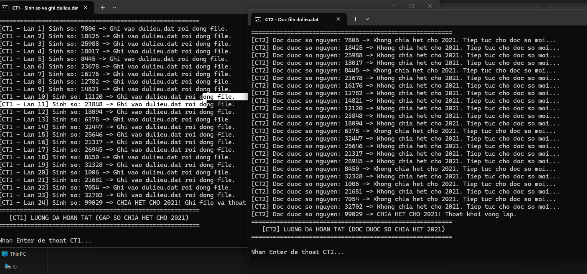
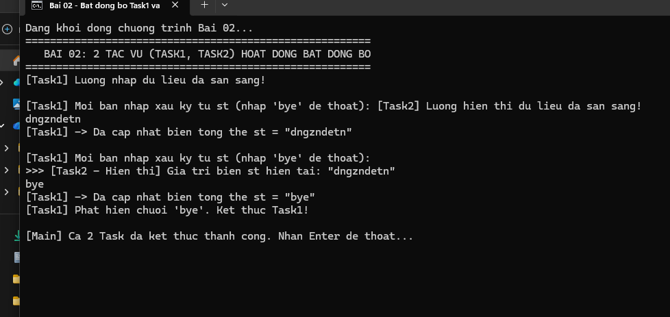
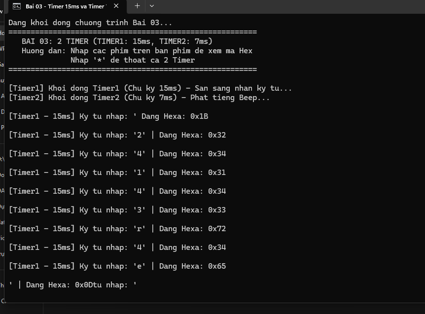
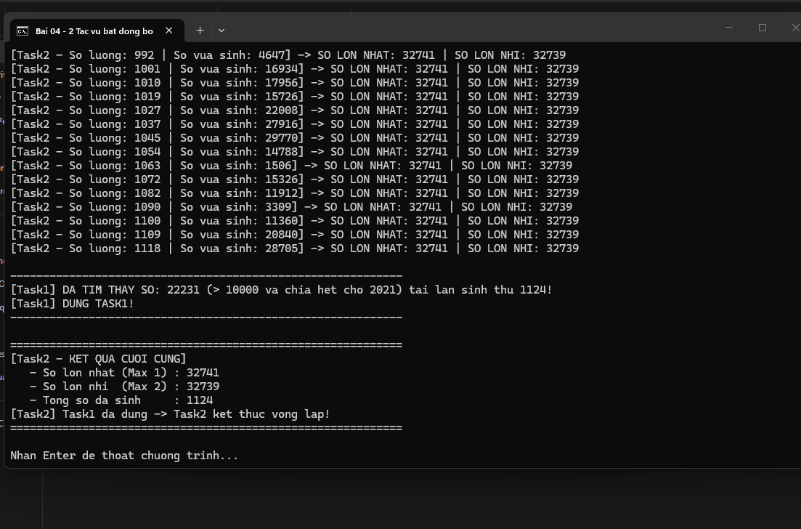

 BÀI TẬP LẬP TRÌNH ĐA LUỒNG & BẤT ĐỒNG BỘ
ĐÀM ĐỨC HUY _ 23810310051_ CNPM1

## 📁 CẤU TRÚC THƯ MỤC BÀI TẬP

Thư mục chính: `D:\Desktop\BaiTap_LapTrinh_DaLuong\`

```text
BaiTap_LapTrinh_DaLuong/
│
├── HUONG_DAN_SU_DUNG.md          <-- Hướng dẫn chi tiết này
├── Bien_Dich_Tat_Ca.bat           <-- Script tự động biên dịch toàn bộ mã C++
│
├── Bai01/                        <-- BÀI 01: Trao đổi dữ liệu qua file
│   ├── CT1.cpp                   (Mã nguồn CT1: Sinh số & ghi file dulieu.dat)
│   ├── CT1.exe                   (File thực thi CT1 đã biên dịch sẵn)
│   ├── CT2.cpp                   (Mã nguồn CT2: Đọc file dulieu.dat & hiển thị)
│   ├── CT2.exe                   (File thực thi CT2 đã biên dịch sẵn)
│   └── Chay_CT1_va_CT2.bat       (Khởi động song song cả 2 chương trình)
│
├── Bai02/                        <-- BÀI 02: 2 tác vụ bất đồng bộ (Xâu ký tự)
│   ├── Bai02.cpp                 (Mã nguồn Task1 & Task2)
│   ├── Bai02.exe                 (File thực thi đã biên dịch sẵn)
│   └── Chay_Bai02.bat            (Chạy nhanh chương trình Bài 02)
│
├── Bai03/                        <-- BÀI 03: 2 Timer định thời (15ms & 7ms)
│   ├── Bai03.cpp                 (Mã nguồn Timer1 & Timer2)
│   ├── Bai03.exe                 (File thực thi đã biên dịch sẵn)
│   └── Chay_Bai03.bat            (Chạy nhanh chương trình Bài 03)
│
├── Bai04/                        <-- BÀI 04: 2 tác vụ tìm Max1, Max2 & Beep
│   ├── Bai04.cpp                 (Mã nguồn Task1 & Task2)
│   ├── Bai04.exe                 (File thực thi đã biên dịch sẵn)
│   └── Chay_Bai04.bat            (Chạy nhanh chương trình Bài 04)
│
└── CSharp_Versions/              <-- PHIÊN BẢN C# (.NET) ĐI KÈM
    ├── Bai01_CT1.cs
    ├── Bai01_CT2.cs
    ├── Bai02.cs
    ├── Bai03.cs
    └── Bai04.cs
```

---

## 🚀 HƯỚNG DẪN CHẠY NHANH (KHÔNG CẦN CÀI THÊM GÌ)

Toàn bộ các file `.exe` đã được biên dịch sẵn bằng trình biên dịch MinGW của Dev-C++ trên máy bạn. Bạn chỉ cần:

1. **Chạy Bài 01:** 
   - Vào thư mục `Bai01` -> Click đúp chuột vào file `Chay_CT1_va_CT2.bat`.
   - Hệ thống sẽ mở đồng thời 2 cửa sổ Console: một bên CT1 ghi số vào file `dulieu.dat`, một bên CT2 đọc số và hiển thị theo thời gian thực.
2. **Chạy Bài 02:**
   - Vào thư mục `Bai02` -> Click đúp vào `Chay_Bai02.bat`.
   - Nhập chuỗi bất kỳ từ bàn phím (có dấu cách ở đầu/cuối), quan sát Task2 hiển thị chuỗi đã cắt khoảng trắng. Nhập `bye` để kết thúc cả 2 task.
3. **Chạy Bài 03:**
   - Vào thư mục `Bai03` -> Click đúp vào `Chay_Bai03.bat`.
   - Bấm các phím trên bàn phím, Timer1 (15ms) sẽ hiển thị mã Hexa tương ứng. Timer2 (7ms) sẽ phát tiếng Beep. Bấm phím `*` để kết thúc chương trình.
4. **Chạy Bài 04:**
   - Vào thư mục `Bai04` -> Click đúp vào `Chay_Bai04.bat`.
   - Task1 tự động sinh số mỗi 1ms, Task2 liên tục cập nhật và hiển thị số lớn nhất (Max1), số lớn nhì (Max2) kèm tiếng Beep. Chương trình dừng khi Task1 sinh được số `> 10000` và chia hết cho `2021`.

---

## 📖 GIẢI THÍCH CHI TIẾT TỪNG BÀI TOÁN

### BÀI 01: Trao Đổi Dữ Liệu Qua File Giữa 2 Tiến Trình Độc Lập
- **Chương trình CT1 (Tiến trình tạo dữ liệu):**
  - Sử dụng 1 luồng riêng biệt (`std::thread t1(PhatSinhVaGhiSo)`).
  - Vòng lặp sinh số nguyên không âm 4 byte (`uint32_t`).
  - Mở file `dulieu.dat` ở chế độ ghi đè nhị phân (`std::ios::binary | std::ios::trunc`), ghi đúng 4 byte (`sizeof(uint32_t)`) rồi đóng file ngay để giải phóng tài nguyên cho CT2 đọc.
  - Khi số sinh ra chia hết cho 2021, ghi số này và `break` thoát khỏi vòng lặp.
- **Chương trình CT2 (Tiến trình nhận dữ liệu):**
  - Sử dụng 1 luồng riêng biệt (`std::thread t2(DocSoTuFile)`).
  - Vòng lặp vô hạn mở file `dulieu.dat` ở chế độ đọc nhị phân (`std::ios::binary`), đọc 4 byte vào biến, sau đó đóng file ngay lập tức.
  - Hiển thị giá trị đọc được lên màn hình.
  - Khi phát hiện giá trị đọc được chia hết cho 2021 thì `break` thoát khỏi vòng lặp.

### BÀI 02: 2 Tác Vụ Bất Đồng Bộ Với Chuỗi Ký Tự
- **Biến dùng chung:** Biến tổng thể `std::string st` và cờ trạng thái `std::atomic<bool> isRunning`.
- **Task1 (Luồng nhập liệu):**
  - Chạy trên một luồng riêng biệt, dùng `std::getline(std::cin, rawInput)` nhận chuỗi từ bàn phím.
  - Hàm `Trim()` loại bỏ toàn bộ khoảng trắng ở đầu và cuối chuỗi.
  - Dùng `std::mutex` bảo vệ khi gán chuỗi đã xử lý vào biến tổng thể `st`.
  - Nếu chuỗi sau xử lý là `"bye"` thì dừng vòng lặp Task1 và đặt `isRunning = false`.
- **Task2 (Luồng hiển thị):**
  - Chạy trên một luồng riêng biệt song song với Task1.
  - Vòng lặp kiểm tra biến `st`. Khi có chuỗi mới, hiển thị lên màn hình.
  - Khi biến `st` có giá trị `"bye"`, Task2 thông báo và thoát khỏi vòng lặp.

### BÀI 03: 2 Timer Định Thời (15ms & 7ms)
- **Timer1 (Chu kỳ 15ms):**
  - Chạy định kỳ mỗi 15 mili giây (`sleep_for(milliseconds(15))`).
  - Sử dụng hàm kiểm tra bàn phím không chặn `_kbhit()` và đọc ký tự `_getch()` trong thư viện `<conio.h>`. Điều này giúp Timer không bị block (đóng băng) khi người dùng chưa nhấn phím.
  - Lưu vào biến tổng thể `char c`.
  - Hiển thị ký tự vừa nhấn và mã Hexa dưới định dạng `0x%02X` (ví dụ: phím `A` -> `0x41`).
  - Nếu ký tự nhấn là `*`, dừng Timer1.
- **Timer2 (Chu kỳ 7ms):**
  - Chạy định kỳ mỗi 7 mili giây (`sleep_for(milliseconds(7))`).
  - Phát ra tín hiệu âm thanh Beep (`MessageBeep` / `Beep`).
  - Kiểm tra biến tổng thể `c`, nếu `c == '*'` thì lập tức thoát khỏi vòng lặp.

### BÀI 04: Tìm Số Lớn Nhất & Số Lớn Nhì Bất Đồng Bộ
- **Task1 (Luồng sinh số - Chu kỳ 1ms):**
  - Chu kỳ định thời 1 mili giây (`sleep_for(milliseconds(1))`).
  - Sinh số nguyên ngẫu nhiên liên tục.
  - Cập nhật số lớn nhất (`max1`) và số lớn thứ hai (`max2`) trong cấu trúc khóa `std::mutex`:
    - Nếu số mới `> max1`: `max2 = max1`, `max1 = số mới`.
    - Nếu số mới `< max1` và `> max2`: `max2 = số mới`.
  - Điều kiện dừng: Khi số sinh ra `> 10000` và chia hết cho `2021` (ví dụ: `10105`, `12126`,...). Khi đạt điều kiện, Task1 báo cờ dừng `isTask1Running = false` và thoát vòng lặp.
- **Task2 (Luồng hiển thị & Beep):**
  - Vòng lặp chỉ dừng lại khi Task1 dừng lại (`while (isTask1Running)`).
  - Luôn đọc và hiển thị giá trị `max1` và `max2` tại mọi thời điểm chạy.
  - Mỗi lần hiển thị đều phát ra tiếng `Beep(900, 25)`.
  - Khi Task1 kết thúc, Task2 hiển thị bảng tổng kết kết quả cuối cùng rồi thoát vòng lặp.


# BÀI TẬP LẬP TRÌNH

## Bài 01

### Kết quả chạy chương trình



---

## Bài 02

### Kết quả chạy chương trình



---

## Bài 03

### Kết quả chạy chương trình



---

## Bài 04

### Kết quả chạy chương trình




